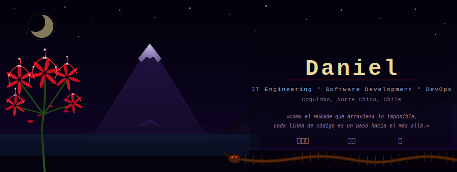
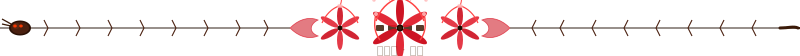

  

  <i>Como el Mukade que atraviesa lo imposible...</i>
  <i>cada línea de código es un paso hacia el más allá.</i>

## About Me

I'm an IT Engineering student focused on **backend development**, with hands-on experience 
in object-oriented languages, REST and GraphQL API development, relational/non-relational databases, 
containerized environments, and clean code principles such as **SOLID**.

- 🎯 Looking for opportunities to contribute to real-world backend or full-stack projects.
- 🌱 Currently learning: NestJS, Next.js, Software Design & Architecture
- 🎮 Outside of tech: gaming, music & TV series

## Tech Stack

**Languages**

**Frameworks & APIs**

**Databases**

**DevOps & Tools**

**Principles & Practices**

## Projects

| 📋 | Proyecto | Descripción | Stack |
|:--:| :--- | :--- | :--- |
| 📚️ | **PROJEIC** | Plataforma de centralización de proyectos, con soporte a metodologías e integración de GitHub Actions | `NestJS` · `Next.js` · `Nginx` |
| 🔬 | **MediSystem** | Sistema de gestión de encuestas clínicas de salud sexual, enfocadas en el tamizaje de VPH. | `NestJS` · `Next.js` · `GraphQL` |
| 🎵 | **KornBeat** | Aplicación Web de streaming de música. | `Node.js` · `React` · `Microservicios` |
| 🌿 | **Guayacan-Project** | Ecosistema e-commerce containerizado. Arquitectura híbrida PostgreSQL + MongoDB. | `Node.js` · `React` · `Docker` |
| 💡 | **Smart-Lighting IoT** | Sistema de iluminación inteligente controlado por red local. | `HTML` · `IoT` · `MCU` |

## GitHub Stats

  

  
 

## Contact

If you're interested in talking about programming, software development, data structures, or simply gaming — feel free to reach out.

  
  
  
  
    

